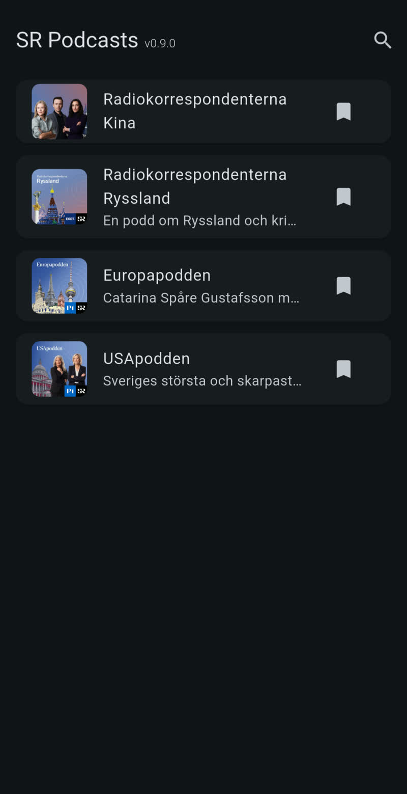
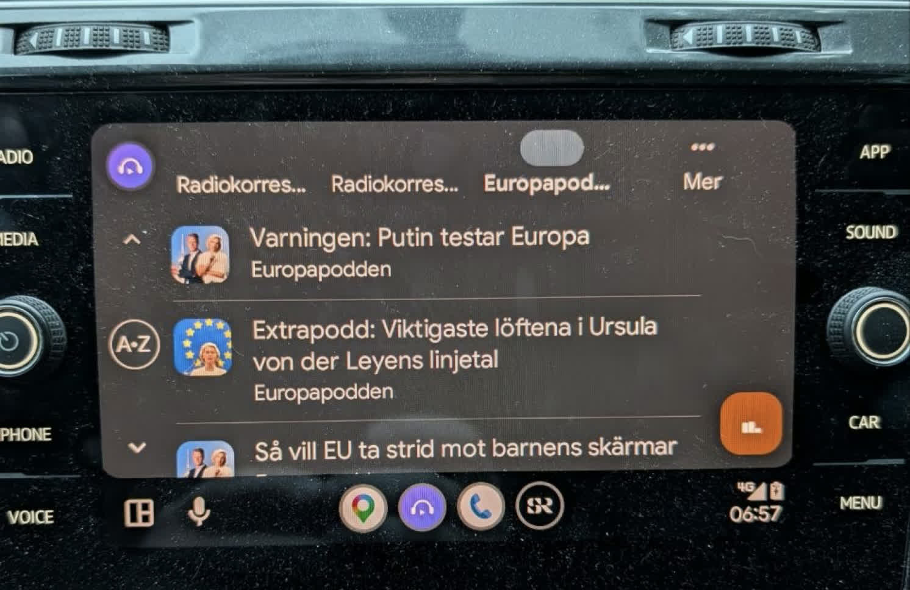
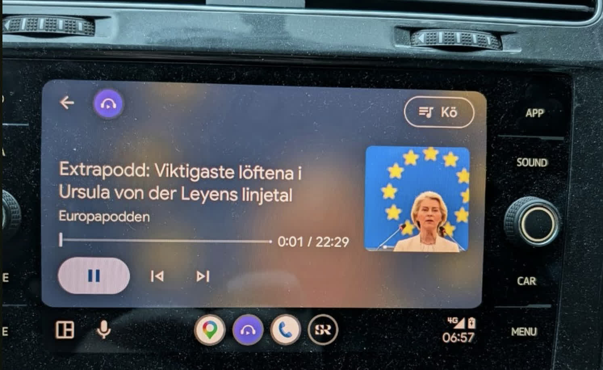
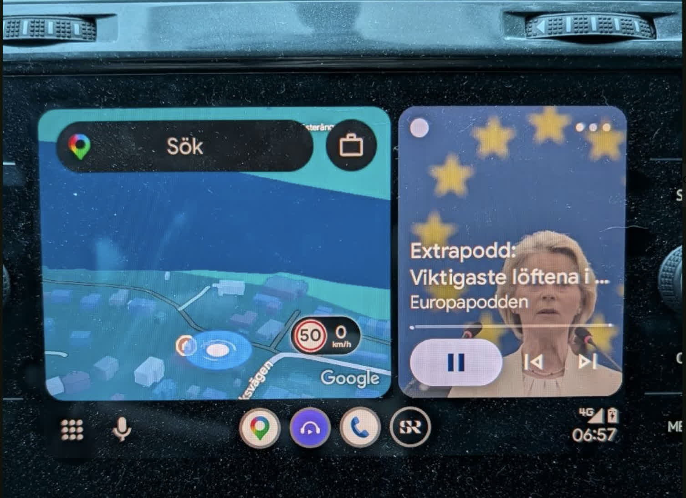

# My favorite Sveriges Radio podcasts

The Sveriges Radio app makes it hard to find a specific podcast while you are
driving a car. This project is a small Android app with a personal short list of
Sveriges Radio podcasts. You open the app and tap a show. The latest episodes
appear without a search.

## What the app does

The app is a Flutter app for Android. The home screen shows the shows that you
subscribe to. A subscription is a saved link to a show in the catalog of
Sveriges Radio. The app ships with the show `Radiokorrespondenterna Kina` as
a pre-selected show in the list.

You add more shows with the search screen. Episodes stream from the public API
of Sveriges Radio as MP3 files. Playback continues when the screen is off.
Android shows a media notification with player controls.

See [here](#use-the-app-in-the-car) for more details about using the app in
the car.

## Screenshot

## Installation

Download the APK package from the release page and install it on your Android phone.

## Search and subscriptions

Tap the magnifier icon on the home screen to open the search screen. Type the
name of a show. The app filters the program catalog while you type. The filter
matches letters in the name or the description of a show. The results contain
podcast programs only.

The app downloads the full program catalog one time per session and filters
the results on the phone, because the search API of Sveriges Radio is
unreliable.

Your subscriptions are saved on the phone. The first app start adds
Radiokorrespondenterna Kina to the list. You can remove that show. The app
saves the change.

## Add a show

You add shows in the app. Tap the magnifier icon, type the name of the show,
and tap the bookmark icon. The show then appears on the home screen.

## Use the app in the car

The app appears in Android Auto on the car screen. The car shows its own
media screens, not the app's phone UI. You browse your saved shows, pick an
episode, and control playback with the car's buttons.

To keep car browsing responsive, Android Auto shows the latest API page, up
to 100 episodes per show. The phone UI can still load the complete episode
history.

Things to check if the app does not show up in the car:

- APKs downloaded from GitHub are installed outside Google Play, including
  release APKs. Android Auto hides all such sideloaded apps unless you enable
  its own developer mode and allow `Unknown sources`. On a Pixel, open
  `Settings` → `Connected devices` → `Connection preferences` →
  `Android Auto` (or search Settings for `Android Auto`). At the bottom,
  expand `Version and permission info` and tap it ten times, accept the
  developer-settings prompt, then open the three-dot menu →
  `Developer settings` and enable `Unknown sources`. This is Android Auto's
  hidden setting, not Android's regular `Install unknown apps` permission.
- Open Android Auto's `Customize launcher` settings and make sure
  `SR Podcasts` is enabled.
- Disconnect and reconnect the USB cable, or restart the phone, after you
  change these settings or install a new build. The car reads the app list
  when the connection starts.

## Playback

The app needs a network connection for episodes. It does not download episodes
for offline playback. It does not store the playback position between app
starts.

## Development

See [DEVELOPMENT.md](DEVELOPMENT.md) for how to run, test, and release the
app, plus developer notes about the Sveriges Radio API, subscription storage,
the Android Auto declaration, and the playback architecture.

## License

The code uses MPL-2.0. See the `LICENSE` file for the full text. Sveriges
Radio owns the audio content.
